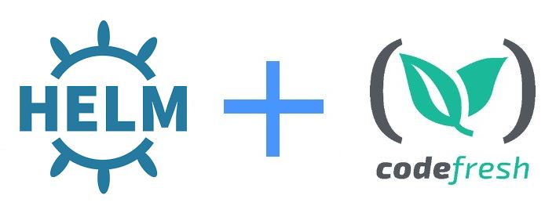

# Codefresh Helm example



This is an example Go application packaged with Docker and Helm.
It is compiled using Codefresh.

To see how you can store and deploy your first Helm Chart using a Codefresh pipeline, please follow [this tutorial](https://codefresh.io/docs/docs/yaml-examples/examples/helm/).


## Create a multi-stage docker image

To compile and package using Docker multi-stage builds

```bash
docker build . -t my-app
```

## To run the docker image

```bash
docker run -p 8080:8080 my-app
```

And then visit http://localhost:8080 in your browser.

## Editing the chart

Make sure to edit the templates and values with your own settings (e.g. docker image deployed). 

Specifically, 
* kube_context: anais-cluster@codefresh-sa in the codefresh.yml

## To use this project in Codefresh

There is also a [codefresh.yml](codefresh.yml) for easy usage with the [Codefresh](https://codefresh.io/) CI/CD platform.

For the direct deployment without storing the helm chart first see [codefresh-do-not-store.yml](codefresh-do-not-store.yml)

More details can be found in [Codefresh documentation](https://codefresh.io/docs/docs/yaml-examples/examples/helm)

